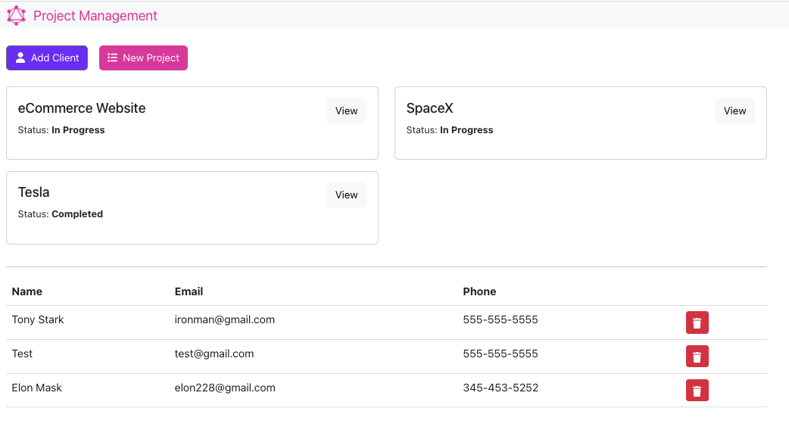
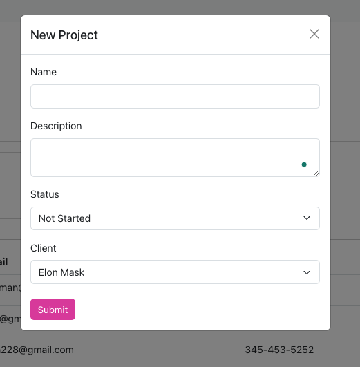
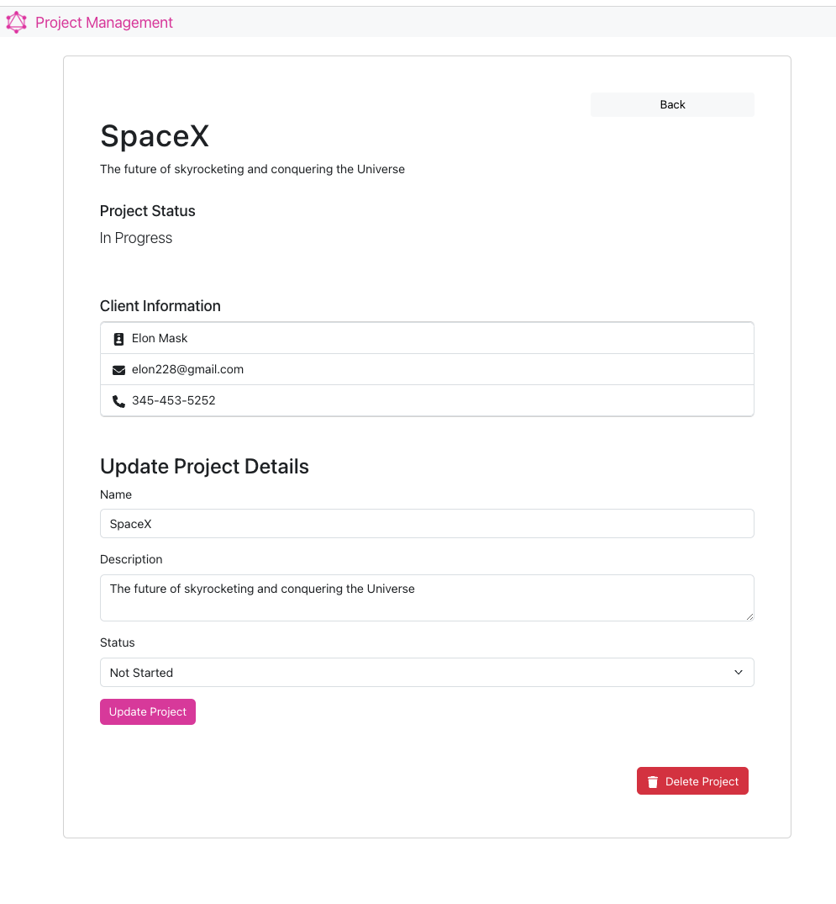

# Project Management

This is a _MERN project with **GraphQL**_ that implements all CRUD operations and has a cool frontend part 🛍️.

## Application Interface

### Home page



### Form for creating a new project



### Project Detail Page



## Getting started

To get the Node server running locally:

- Clone this repo
- `cd server`
- `npm install` to install all required dependencies
- Set up environment variables
- Run `npm start` to start the server

To run the Frontend part of the application

- `cd client`
- `npm install`
- `npm run dev`

## .env structure (server)

```.env
NODE_ENV=development
PORT=8080
MONGO_URI=
```
